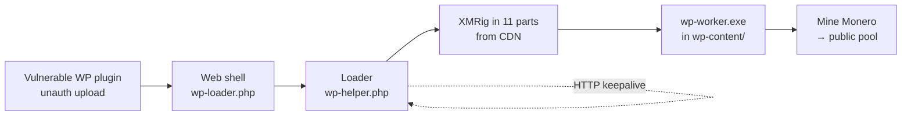

# WordPress → XMRig Cryptojacking: Incident Analysis + Reproducible Lab

A technical incident-response case study of a WordPress server compromised for
Monero mining — with **reverse-engineering of the samples** and a **fully isolated,
reproducible lab** that recreates the entire attack chain safely.

> **Ethics.** Investigated under authorization. The victim/client is anonymized
> throughout. Attacker indicators are published (defanged) for community threat
> intelligence. The lab runs a real miner but on an internet-isolated network — it
> mines into a fake local pool and nothing leaves the host.

---

## 📖 Read the writeup

**➡️ [Full technical analysis](./analysis/xmrig-wordpress-cryptojacking.md)** — attack
chain, artifact-by-artifact analysis, XMRig static analysis/RE, root cause,
detection & hardening.

- 🧬 [Indicators of Compromise + YARA rules](./analysis/IOCs.md)
- 💼 [LinkedIn post (ready to paste)](./analysis/linkedin-post.md)

## 🧪 Run the lab

**➡️ [`academy-wp-lab/`](./academy-wp-lab/README.md)** — a 5-service Docker stack
that reproduces the compromise on an `internal: true` network (no internet route).
Runs a real XMRig sinking into a local fake Stratum pool.

```bash
cd academy-wp-lab
docker compose up -d --build     # start (WordPress, DB, CDN, fake pool, proxy)
./trigger.sh                     # detonate: dropper -> miner -> pool shows shares
./reset.sh                       # wipe everything the attack dropped
```

Two modes via `LAB_MODE` in `.env`:
- `exploit` — exploit the real **wp-file-manager 6.0 / CVE-2020-25213** upload yourself.
- `preseeded` — start from a dropped web shell; focus on the miner + incident response.

Lab guides: [attacker walkthrough](./academy-wp-lab/docs/01-attacker-walkthrough.md) ·
[defender IR](./academy-wp-lab/docs/02-defender-IR.md) ·
[detection & hardening](./academy-wp-lab/docs/03-detection.md)

---

## The attack in one diagram



## What made it interesting

- **Stock XMRig 6.26.0, self-compiled** on Alpine/musl → fresh hash, defeats
  signature-only AV.
- **No pool/wallet in the binary** → config externalized to the loader; one reusable
  clean binary.
- **11-part chunked delivery** → quieter than one 8 MB download.
- **Persistence lived in HTTP** → no cron, no systemd; a periodic GET restarts the miner.

---

## Repository layout

```
analysis/         public writeup, IOCs + YARA, LinkedIn post
academy-wp-lab/   the reproducible, isolated Docker lab
_layouts/ assets/ _config.yml   GitHub Pages (Jekyll + vendored Mermaid)
```

> Raw forensic artifacts and internal design notes are kept **private** (gitignored,
> not published) because they contain victim-identifying data.

## GitHub Pages

This repo is a Jekyll site (`_config.yml`, `_layouts/`, vendored Mermaid in
`assets/`). Enable **Settings → Pages → Deploy from branch → `main` / root** and the
writeup publishes with rendered diagrams and screenshots at:

**https://zenithgenius.github.io/wordpress-xmrig-cryptojacking/analysis/xmrig-wordpress-cryptojacking.html**

The site build excludes the private `incident-2026-07-14/` and `docs/` directories.
The writeup also renders in full (Mermaid included) directly on GitHub without Pages.

## Credits

Analysis & lab by **Isaac Joumessi**. Miner: [XMRig](https://github.com/xmrig/xmrig)
(open source, abused here). For educational and defensive use only.
