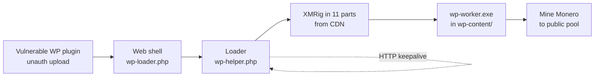

# WordPress to XMRig Cryptojacking: Incident Analysis and Reproducible Lab

A technical incident-response case study of a WordPress server compromised for Monero mining. It covers the forensic investigation, reverse-engineering of the samples, and a fully isolated lab that recreates the entire attack chain safely.

> **Ethics.** Investigated under authorization. The affected party is anonymized throughout. Attacker indicators are published, defanged, for community threat intelligence. The lab runs a real miner, but on an internet-isolated network: it mines into a fake local pool and nothing leaves the host.

---

## Read the writeup

**[📖 Read online](https://zenithgenius.github.io/wordpress-xmrig-cryptojacking/analysis/xmrig-wordpress-cryptojacking.html)** (if GitHub Pages is enabled) | [Full technical analysis](./analysis/xmrig-wordpress-cryptojacking.md) covers the attack chain, artifact-by-artifact analysis, XMRig static analysis, root cause, and detection and hardening.

- [Indicators of compromise and YARA rules](./analysis/IOCs.md)

## Run the lab

[`academy-wp-lab/`](./academy-wp-lab/README.md) is a five-service Docker stack that reproduces the compromise on an `internal: true` network with no internet route. It runs a real XMRig sinking into a local fake Stratum pool.

```bash
cd academy-wp-lab
docker compose up -d --build     # start (WordPress, DB, CDN, fake pool, proxy)
./trigger.sh                     # detonate: dropper, miner, pool shows shares
./reset.sh                       # wipe everything the attack dropped
```

Two modes, set via `LAB_MODE` in `.env`:

- `exploit`: exploit the real wp-file-manager 6.0 (CVE-2020-25213) upload yourself.
- `preseeded`: start from a dropped web shell and focus on the miner and incident response.

Lab guides: [attacker walkthrough](./academy-wp-lab/docs/01-attacker-walkthrough.md), [defender incident response](./academy-wp-lab/docs/02-defender-IR.md), [detection and hardening](./academy-wp-lab/docs/03-detection.md).

---

## The attack in one diagram



## What made it interesting

- **Stock XMRig 6.26.0, self-compiled** on Alpine and musl, giving a fresh hash that defeats signature-only antivirus.
- **No pool or wallet in the binary.** Configuration is externalized to the loader, so one clean binary is reusable across victims.
- **Eleven-part chunked delivery**, quieter than a single 8 MB download.
- **Persistence lived in HTTP.** No cron, no systemd; a periodic GET restarts the miner.

---

## Repository layout

```
analysis/         public writeup, IOCs and YARA, LinkedIn post
academy-wp-lab/   the reproducible, isolated Docker lab
_layouts/ assets/ _config.yml   GitHub Pages (Jekyll with vendored Mermaid and fonts)
```

> Raw forensic artifacts and internal design notes are kept private (gitignored, not published) because they contain victim-identifying data.

## Note

**https://zenithgenius.github.io/wordpress-xmrig-cryptojacking/analysis/xmrig-wordpress-cryptojacking.html**

The site build excludes the private `incident-2026-07-14/` and `docs/` directories.

## Credits

Analysis and lab by Isaac Joumessi. Miner: [XMRig](https://github.com/xmrig/xmrig), open source, abused here. For educational and defensive use only.
